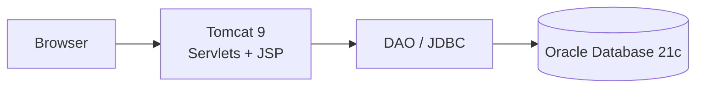

# AGENTS.md — VehicleServiceApp

Purpose: Single source of truth for this legacy JSP/Servlets vehicle service management app. Read this to understand the structure, tech stack, run workflow, and key pitfalls.

## Product Overview

Legacy automotive web application for basic vehicle CRUD operations (add, view, search, update, delete). Built with Java 8, JSP, Servlets, JDBC on Apache Tomcat, using Oracle Database as the system of record. Evidence: README.md.

### Repository Topology

- README.md — Project overview, stack, setup, URLs
- run.md — Ancillary run notes (not authoritative)
- vehicle_service.db — SQLite file not referenced by app (see Pitfalls)
- src/main/webapp/
  - index.jsp, addVehicle.jsp, viewVehicles.jsp, searchVehicle.jsp, searchResult.jsp, editVehicle.jsp — JSP views
  - css/style.css — Styles
  - META-INF/MANIFEST.MF — App metadata
  - WEB-INF/ — Container-only resources; place ojdbc8.jar under WEB-INF/lib per README.md
- src/main/java/ — Java sources root (package folder exists, but no .java files present in tree; see README.md for expected classes)
- .settings/, .classpath, .project — Eclipse project metadata

### Tech Stack at a Glance

- Languages: Java 8 (JDK 1.8), JSP, HTML, CSS (README.md)
- Backend frameworks: Servlets (Tomcat 9), JDBC (README.md)
- Data stores: Oracle Database 21c (README.md). Note: vehicle_service.db present but unused by documented stack.
- Infrastructure: Native execution under Tomcat; no containerisation detected (no Docker files)
- CI/CD: None detected (no .github/workflows, etc.)
- IDE: Eclipse IDE for Enterprise Java Developers (README.md)

## Architecture

Monolithic web application running on Apache Tomcat:

- Browser requests hit Servlet endpoints and JSP views in src/main/webapp.
- Data access via JDBC (ojdbc8.jar) to Oracle DB (connection example in README.md).
- Typical classes (inferred from README.md): DBConnection, VehicleDAO, Vehicle entity, and request-handling Servlets.

Mermaid (logical, inferred from README.md):

Verify with team — inferred structure and class names from README.md; source files not present in tree.

### Key Architectural Decisions

- Legacy Java 8 + JSP/Servlets + JDBC stack to reflect common enterprise patterns (README.md).
- Oracle Database as single source of truth (README.md).
- Manual JDBC driver provisioning under WEB-INF/lib (README.md).

## Service / Package

### VehicleServiceApp (Monolith web app)

- Path: src/main/webapp (views), src/main/java (Java sources root)
- Purpose: Vehicle CRUD web UI and server-side handling
- Tech stack: Java 8, JSP, Servlets, JDBC; ojdbc8.jar driver (README.md)
- Database: Oracle 21c; example URL jdbc:oracle:thin:@localhost:1521/XEPDB1; user SYSTEM (README.md). Verify with team for actual schema owner and credentials.
- API: Servlet endpoints with JSP views; example URLs (README.md):
  - /VehicleServiceApp/ (home)
  - /VehicleServiceApp/viewVehicles
  - /VehicleServiceApp/searchVehicle.jsp (direct JSP)
- Build/Run: Eclipse “Run on Server” (Tomcat v9.0) (README.md)
- Tests: None detected
- Connections: Direct JDBC to Oracle via DBConnection (example provided in README.md)

## Database Inventory

- Oracle Database 21c — default listener 1521; example service XEPDB1 (README.md). Table VEHICLE with columns: VEHICLE_ID (PK, NUMBER), OWNER_NAME (VARCHAR2(100)), MODEL_NAME (VARCHAR2(100)), REG_NUMBER (VARCHAR2(20)) (README.md).

## External Integrations

- None detected — confirm with team

## Conventions

### Code Style

- Java 8 conventions; no formatter/linters configured in repo — confirm with team
- JSP for views in src/main/webapp

### Validation Rules (from README.md)

- VEHICLE_ID: numeric and > 0
- OWNER_NAME: min 3 chars
- REG_NUMBER: pattern [A-Z]{2}[0-9]{2}[A-Z]{2}[0-9]{4} (e.g., TS09AB1234)
- All fields required

### Branching & Commits

- Not documented — confirm with team

### Build / Lint / Format

- Install deps: Manual — place ojdbc8.jar under WEB-INF/lib (README.md)
- Build: N/A (Eclipse-managed, no Maven/Gradle files detected)
- Run dev: Eclipse → Run on Server (Tomcat v9.0) (README.md)
- Type check / Lint / Format: None configured — confirm with team
- Tests: None detected

### Error Handling

- Example code (README.md) uses try/catch with e.printStackTrace(); no logging framework detected.

### Logging

- No logging framework configured (no logback/log4j files present) — confirm with team
- Avoid printing stack traces in production; consider adding a logger (future enhancement)

### Dependency Injection

- None detected (plain new and static helpers per README.md snippet)

## Local Development

### Supported Host OSes

- Windows/macOS/Linux via Eclipse + Tomcat (README.md shows Windows Tomcat path example). Cross-platform support expected; verify with team.

### Prerequisites

- Java JDK 1.8
- Apache Tomcat 9.x
- Oracle Database 21c (local or accessible)
- ojdbc8.jar (copy to WEB-INF/lib)
- Eclipse IDE for Enterprise Java Developers
  All per README.md.

### First-Time Setup (from README.md)

1. Create schema objects in Oracle:

- sqlplus system
- CREATE TABLE VEHICLE (...); (see README.md)

2. Copy ojdbc8.jar to src/main/webapp/WEB-INF/lib/
3. Update DBConnection with driver and connection URL; replace password with local SYSTEM password (README.md example)
4. In Eclipse: Preferences → Server → Runtime Environments → Add Apache Tomcat v9.0
5. Run: Right-click project → Run As → Run on Server (Tomcat v9.0)

### Containerised vs Native

- Native execution — no Docker/Compose detected

### Local URLs (from README.md)

- Home: http://localhost:8080/VehicleServiceApp/
- View Vehicles: http://localhost:8080/VehicleServiceApp/viewVehicles
- Search Vehicle: http://localhost:8080/VehicleServiceApp/searchVehicle.jsp

## CI/CD

- None detected — no pipeline configs present

## Observability

- None detected — confirm with team

## Pitfalls & Quirks

- Oracle driver placement: ojdbc8.jar must be under WEB-INF/lib or app won’t connect (README.md).
- Hard-coded DB credentials: Example DBConnection in README.md uses SYSTEM user and plaintext password; do not commit real credentials. Use a dedicated schema/user and externalised config.
- Database coupling: Direct JDBC without connection pooling or ORM; handle resource closing carefully to avoid leaks (close ResultSet/Statement/Connection in finally/try-with-resources).
- vehicle_service.db present at repo root: Not referenced in README.md; likely unused (SQLite). Risk of confusion; do not rely on it for this app.
- Missing Java sources in tree: README.md lists expected classes (DBConnection, VehicleDAO, Servlets, Vehicle), but src/main/java currently contains only package folder. Verify source presence or regenerate as needed.
- Tomcat version: Use Tomcat 9.x as per README.md; mismatched servlet container may cause API incompatibilities.
- WEB-INF/web.xml: Not present in listing; ensure either servlet annotations (@WebServlet) are used or web.xml is provided. Verify at runtime.

## Adding a New Feature — Checklist (Servlet + JSP)

1. Define data changes in Oracle (DDL as needed). Create/update DAO methods.
2. Implement a Servlet under src/main/java (package per com.automotive per README.md), mapping URL via @WebServlet or web.xml.
3. Add corresponding JSP under src/main/webapp and link routes from index.jsp.
4. Validate inputs per existing rules; return errors to JSP.
5. Test locally on Tomcat 9, verify DB read/write.
6. Avoid committing secrets; externalise DB config where possible.

## Glossary

- DAO: Data Access Object; encapsulates JDBC operations.
- JSP: JavaServer Pages; server-side view templates rendered by Tomcat.

Last updated: 2026-06-23. Evidence sources: README.md; src/main/webapp/\*; presence of Eclipse project files; absence of build manifests and CI configs.
