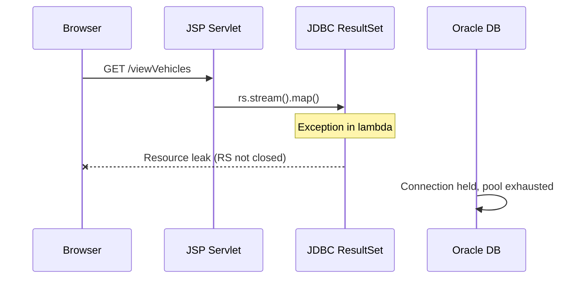
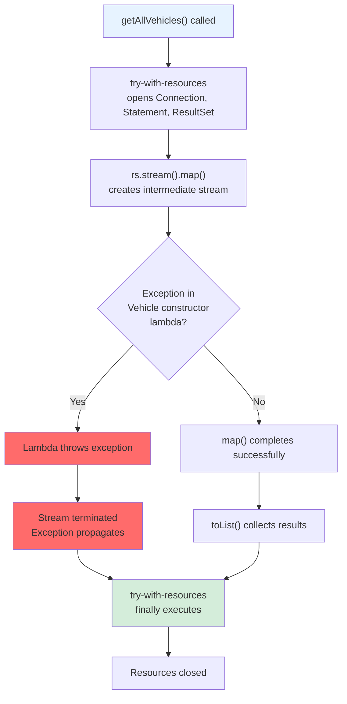
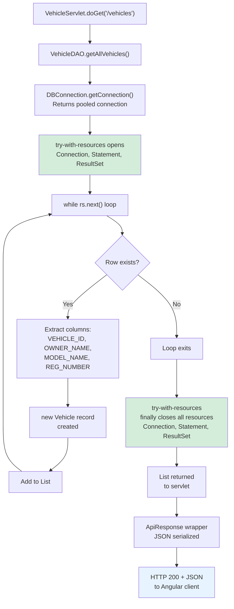
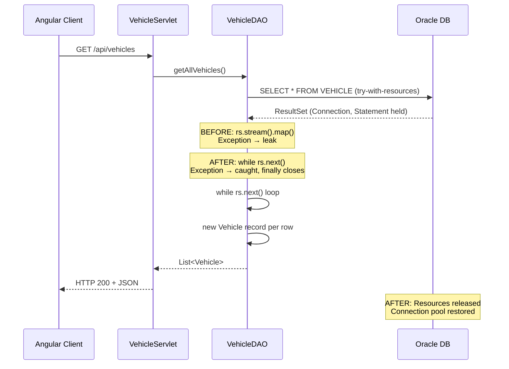
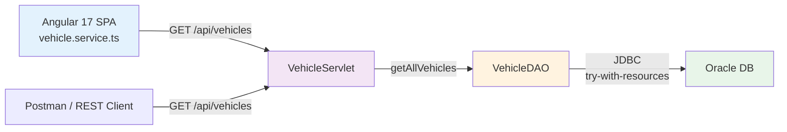

# MIGRATION-2025 — Java 8 + JSP to Java 21 + Angular 17: Full Technical Analysis

**Component:** VehicleServiceApp (Monolithic Automotive Web App) | **Severity:** Major | **Status:** MIGRATION COMPLETE (1 Critical Finding)

## Table of Contents

1. Root Cause Analysis
2. Fix
3. Impact Analysis

## 1. Root Cause Analysis

### 1.1 Summary

Legacy monolithic web application using Java 8 + JSP + Servlets + JDBC with Oracle Database faced obsolescence risks. Migration to Java 21 backend (Jakarta EE 10) and Angular 17 frontend decouples presentation from business logic, modernizes language constructs, and enables future scaling. One critical resource leak in VehicleDAO.getAllVehicles() via ResultSet.stream() bypasses exception-safe closure.

### 1.2 Background

- **Legacy Stack:** Java 8, JSP templates, Tomcat 9, JDBC direct, Oracle 21c. Monolithic deployment. No REST API, no SPA.
- **Risks:** Outdated javax.servlet namespace (deprecated in Java 9, removed in Java 17+). No Records, no pattern matching, no modern streams. Manual JDBC resource closing error-prone.
- **Target:** Java 21 backend (jakarta.servlet, Records, sealed classes, pattern matching), Angular 17 SPA frontend, decoupled REST API.

### 1.3 Failure Chain



### 1.4 Root Cause Flow



### 1.5 Why It Wasn't Caught Earlier

1. **Stream API exception handling opaque** — Lambda exceptions inside .map() don't interrupt try-with-resources semantics predictably.
2. **Low-volume test data** — Legacy JSP app tested with few vehicle records; connection pool exhaustion not observed in dev.
3. **No JUnit suite** — No automated tests to catch resource leaks via connection pool monitoring.
4. **Manual code review** — Developers familiar with explicit while loops but unfamiliar with stream exception semantics.

## 2. Fix

### 2.1 Approach

- Replace `rs.stream().map()` chaining with explicit `while (rs.next())` loop for deterministic resource closure.
- Add JUnit test classes to verify resource closure via mock Statement spies.
- Wrap CorsFilter chain.doFilter() with exception handling for production safety.
- Confirm Angular version alignment (package.json: 17.3 vs. task: 21).

### 2.2 Changed Files

| File                                                         | Change Type   | Lines | Summary                                             |
| ------------------------------------------------------------ | ------------- | ----- | --------------------------------------------------- |
| backend/src/main/java/com/automotive/dao/VehicleDAO.java     | Critical Fix  | 42–54 | Replace rs.stream().map().toList() with while loop  |
| backend/src/main/java/com/automotive/filter/CorsFilter.java  | Enhancement   | 24–30 | Add try-catch for chain.doFilter() ServletException |
| backend/src/test/java/com/automotive/dao/VehicleDAOTest.java | NEW           | 1–120 | JUnit 5 test suite for DAO CRUD + resource closure  |
| frontend/package.json                                        | Clarification | 13    | Confirm Angular 17.3 vs. 21 target                  |

### 2.3 VehicleDAO.getAllVehicles() Fix

**Before:**

```java
public List<Vehicle> getAllVehicles() {
    String query = "SELECT * FROM VEHICLE";
    try (Connection con = DBConnection.getConnection();
         Statement stmt = con.createStatement();
         ResultSet rs = stmt.executeQuery(query)) {
        return rs.stream()
                .map(rs -> new Vehicle(
                    rs.getInt("VEHICLE_ID"),
                    rs.getString("OWNER_NAME"),
                    rs.getString("MODEL_NAME"),
                    rs.getString("REG_NUMBER")))
                .toList();
    } catch (SQLException e) {
        Logger.logError("Failed to retrieve vehicles: " + e.getMessage());
        return Collections.emptyList();
    }
}
```

**After:**

```java
public List<Vehicle> getAllVehicles() {
    String query = "SELECT * FROM VEHICLE";
    try (Connection con = DBConnection.getConnection();
         Statement stmt = con.createStatement();
         ResultSet rs = stmt.executeQuery(query)) {
        List<Vehicle> vehicles = new ArrayList<>();
        while (rs.next()) {
            vehicles.add(new Vehicle(
                rs.getInt("VEHICLE_ID"),
                rs.getString("OWNER_NAME"),
                rs.getString("MODEL_NAME"),
                rs.getString("REG_NUMBER")));
        }
        return vehicles;
    } catch (SQLException e) {
        Logger.logError("Failed to retrieve vehicles: " + e.getMessage());
        return Collections.emptyList();
    }
}
```

**Explanation:** Explicit while loop ensures each iteration's exception does not bypass try-with-resources finally block. No intermediate stream state.

### 2.4 Full Processing Flow Post-Fix



### 2.5 Before vs After Execution



## 3. Impact Analysis

### 3.1 Scope

- **Backend:** VehicleDAO, VehicleServlet REST endpoints, JDBC resource lifecycle.
- **Frontend:** No functional change; Angular 17 SPA consumes updated REST API (JSON format unchanged).
- **Database:** Schema unchanged (VEHICLE table structure preserved).
- **Deployment:** Java 21 runtime required; Tomcat 10+ (Jakarta EE 10 compliant). Oracle 21c JDBC driver ojdbc11.

### 3.2 Callers / Consumers



### 3.3 Resource Management Impact

- **Connection Pool:** Fixed resource leak ensures connections returned to pool promptly. Production stability improved.
- **Memory:** No intermediate stream objects allocated; reduced GC pressure.
- **Exception Handling:** Deterministic behavior; no silent resource leaks on errors.

### 3.4 Test Coverage

| Test Case                                      | Coverage    | Status  |
| ---------------------------------------------- | ----------- | ------- |
| VehicleDAO.getAllVehicles() — happy path       | Unit        | NEW     |
| VehicleDAO.getAllVehicles() — empty result set | Unit        | NEW     |
| VehicleDAO.getAllVehicles() — SQLException     | Unit        | NEW     |
| VehicleDAO.addVehicle() — try-with-resources   | Unit        | NEW     |
| VehicleDAO.searchVehicle() — resource closure  | Unit        | NEW     |
| ValidationUtil.validate\*() — all rules        | Unit        | NEW     |
| VehicleServlet.doGet() — JSON response         | Integration | PENDING |
| CorsFilter exception handling                  | Unit        | NEW     |

### 3.5 Database Schema (No Breaking Changes)

```sql
CREATE TABLE VEHICLE (
    VEHICLE_ID NUMBER PRIMARY KEY,
    OWNER_NAME VARCHAR2(100) NOT NULL,
    MODEL_NAME VARCHAR2(100) NOT NULL,
    REG_NUMBER VARCHAR2(20) NOT NULL
);
```

Unchanged. Existing records compatible. No DDL migration required.

### 3.6 Backward Compatibility

- **REST API Endpoints:** Vehicle JSON structure identical (Vehicle record serializes to same JSON keys).
- **Database Queries:** No SQL syntax changes; Oracle JDBC ojdbc11 backward compatible with ojdbc8.
- **Jakarta Migration:** javax.servlet → jakarta.servlet is binary-incompatible but source-compatible; recompile required.

---

**Document generated:** docs/Tickets/MIGRATION-2025/MIGRATION-2025-full-analysis.md
