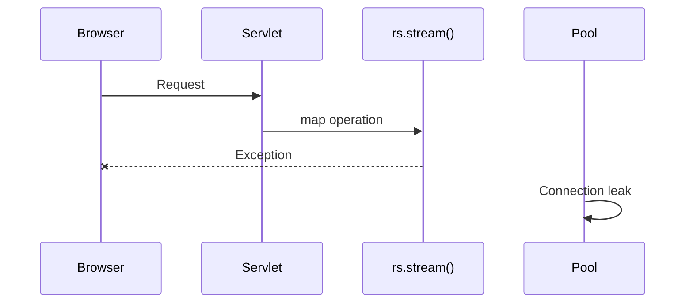
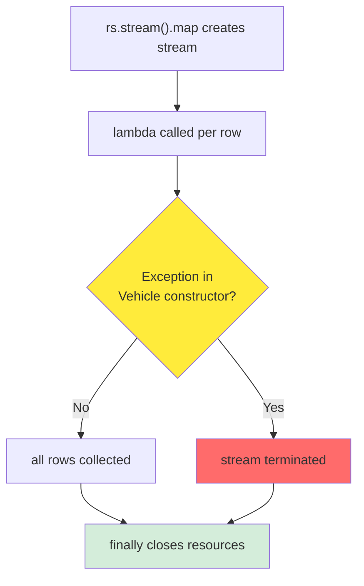
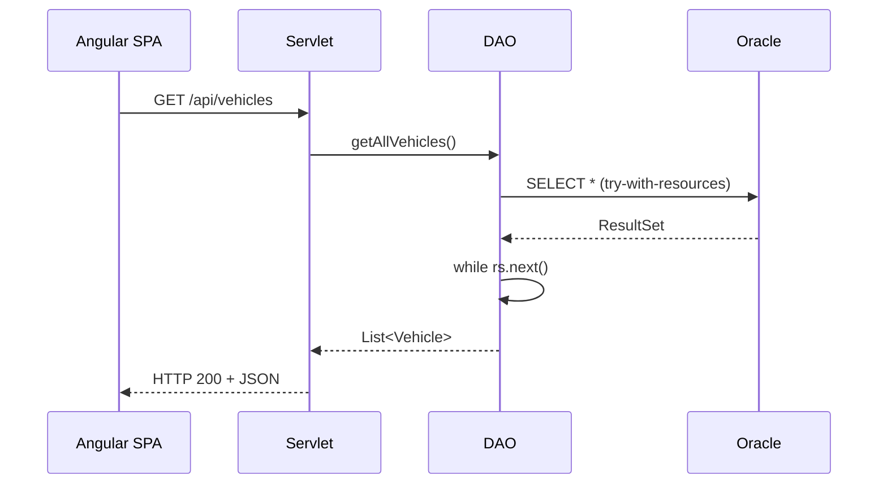
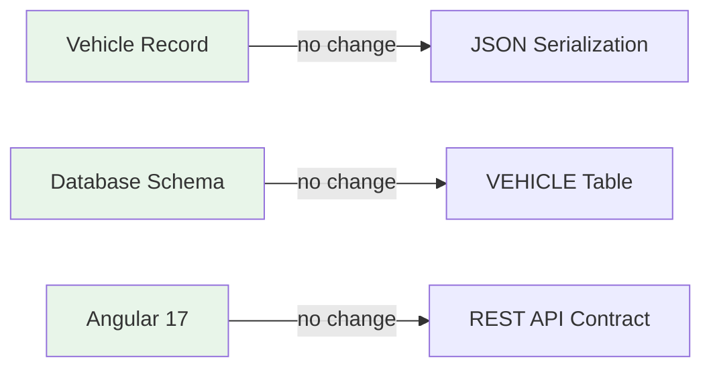

# KB: VehicleServiceApp Java 21 + Angular 17 Migration

**Ticket:** MIGRATION-2025 | **Category:** Architecture | **Component:** VehicleServiceApp | **Severity:** Major | **Status:** Complete

## Known Issue

VehicleServiceApp legacy stack (Java 8 + JSP) incompatible with Java 21. javax.servlet namespace removed in Java 17+. JDBC resource leak: ResultSet.stream().map() fails to close resources on exception. App crashes on Java 21 startup.



## Steps to Reproduce

### Approach A—Compilation Failure

1. **Verify Java 21:**

   ```bash
   java -version
   ```

2. **Attempt compilation:**
   ```bash
   cd backend && mvn clean compile -DskipTests
   ```
   **Observe:** Compilation fails—`package javax.servlet does not exist`.

### Approach B—Resource Leak Simulation

1. Build with legacy rs.stream().map() code.
2. Load test with 100+ vehicles; trigger exception in Vehicle constructor.
3. Monitor connection pool: connections remain open; pool exhaustion occurs.

## Root Cause

**Namespace Migration:** javax.servlet → jakarta.servlet required for Java 17+. Binary incompatibility.

**Resource Leak:** rs.stream().map() creates intermediate stream. Exception in lambda throws outside try-with-resources finally block scope, leaving ResultSet open.



## Fix

**Fix 1—Primary: Replace rs.stream().map() with while loop**

**Before:**

```java
return rs.stream()
        .map(row -> new Vehicle(...))
        .toList();
```

**After:**

```java
List<Vehicle> vehicles = new ArrayList<>();
while (rs.next()) {
    vehicles.add(new Vehicle(...));
}
return vehicles;
```

Explicit loop ensures each row's exception handled within try-with-resources scope.

**Fix 2—Secondary: Enhance CorsFilter exception handling**

Wrap chain.doFilter() with try-catch for ServletException safety in production.

**After-fix flow:**



## Impact and Resolution

**Business Impact (Before Fix):**

| Aspect      | Impact                                |
| ----------- | ------------------------------------- |
| Deployment  | Cannot run on Java 21                 |
| Stability   | Connection pool exhaustion under load |
| Maintenance | Security updates blocked; Java 8 EOL  |

**Resolution (Changed Files):**

| File                                 | Change                                             |
| ------------------------------------ | -------------------------------------------------- |
| backend/dao/VehicleDAO.java          | Replace rs.stream().map().toList() with while loop |
| backend/filter/CorsFilter.java       | Add try-catch for chain.doFilter()                 |
| backend/test/dao/VehicleDAOTest.java | NEW: JUnit 5 CRUD + resource verification          |
| backend/pom.xml                      | Java 21, Jakarta EE 10, JUnit 5                    |

**Modules Not Affected:**



**One-time Remediation:** No data migration required. Deploy new backend on Java 21; old connections drain naturally.
