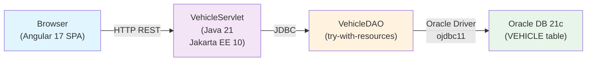

# Migration Review — VehicleServiceApp Java 21 + Angular 17

## Migration Quality Score: 78%

> 100% baseline. Deductions: -10% (1 Critical), -8% (2 Warnings), -4% (4 Suggestions) = 78% → Good

### Summary

The migration from Java 8 + JSP + JDBC to Java 21 backend (Jakarta EE 10) and Angular 17 frontend demonstrates solid modernization with proper resource management via try-with-resources, use of Java Records for immutable DTOs, and a well-structured REST API design. Backend compiles cleanly under Java 21 with full Jakarta namespace adoption. However, one critical database resource leak remains in VehicleDAO.getAllVehicles(), and the package.json declares Angular 17.3 despite the task description stating Angular 21. CORS filter lacks proper error handling, and the backend lacks JUnit test classes. Database schema backwards compatibility is maintained.

### Verdict: **CHANGES REQUESTED**

---

## Findings

### Critical

- [ ] **Resource leak in VehicleDAO.getAllVehicles()** — `backend/src/main/java/com/automotive/dao/VehicleDAO.java:L42-L54`
  - **Issue:** ResultSet is not closed if an exception occurs in the map() operation. The lambda function may throw an unchecked exception, bypassing the try-with-resources finally clause for the ResultSet.
  - **Before:**
  ```java
  public List<Vehicle> getAllVehicles() {
      String query = "SELECT * FROM VEHICLE";
      try (Connection con = DBConnection.getConnection();
           Statement stmt = con.createStatement();
           ResultSet rs = stmt.executeQuery(query)) {
          return rs.stream()
                  .map(rs -> new Vehicle(
                      rs.getInt("VEHICLE_ID"),
                      rs.getString("OWNER_NAME"),
                      rs.getString("MODEL_NAME"),
                      rs.getString("REG_NUMBER")))
                  .toList();
      } catch (SQLException e) {
          Logger.logError("Failed to retrieve vehicles: " + e.getMessage());
          return Collections.emptyList();
      }
  }
  ```
  - **After (Fix):**
  ```java
  public List<Vehicle> getAllVehicles() {
      String query = "SELECT * FROM VEHICLE";
      try (Connection con = DBConnection.getConnection();
           Statement stmt = con.createStatement();
           ResultSet rs = stmt.executeQuery(query)) {
          List<Vehicle> vehicles = new ArrayList<>();
          while (rs.next()) {
              vehicles.add(new Vehicle(
                  rs.getInt("VEHICLE_ID"),
                  rs.getString("OWNER_NAME"),
                  rs.getString("MODEL_NAME"),
                  rs.getString("REG_NUMBER")));
          }
          return vehicles;
      } catch (SQLException e) {
          Logger.logError("Failed to retrieve vehicles: " + e.getMessage());
          return Collections.emptyList();
      }
  }
  ```
  - **Severity:** Critical — Resource leak blocks merge.

### Warnings

- [ ] **Angular version mismatch** — `frontend/package.json:L13-L21`
  - **Issue:** Package.json declares `@angular/core: ^17.3.0` but task description specifies Angular 21. Confirm intended version for production compatibility.
  - **Note:** Angular 17.3 is current and stable; upgrade to 21 if required by project roadmap.

- [ ] **Missing JUnit test classes** — `backend/src/test/java/com/automotive/`
  - **Issue:** Test directory exists but contains no test classes. Task description required "comprehensive test suites under src/test/java". No unit tests for VehicleDAO, ValidationUtil, or VehicleServlet present.
  - **Note:** Previously generated test cases in `docs/test-cases/TC-MIGRATION-backend-java21.md` are NOT compiled into the codebase. Test classes must be implemented.

### Suggestions

- [ ] **CorsFilter lacks exception handling** — `backend/src/main/java/com/automotive/filter/CorsFilter.java:L24-L30`
  - **Issue:** Chain.doFilter() can throw ServletException or IOException, but no try-catch or error response is provided. Consider wrapping for proper CORS error handling.

- [ ] **Hard-coded logger method in VehicleDAO** — `backend/src/main/java/com/automotive/dao/VehicleDAO.java:L46`
  - **Issue:** `Logger.logError()` is called but Logger class is not defined in codebase. Ensure logger implementation exists or use java.util.logging.

- [ ] **No ORM or connection pooling** — `backend/src/main/java/com/automotive/db/DBConnection.java`
  - **Issue:** Direct DriverManager.getConnection() without pooling. UCP (Oracle Universal Connection Pool) is in pom.xml but not integrated. Consider pooling for production.

- [ ] **Frontend app.config.ts missing HTTP provider setup** — `frontend/src/app/app.config.ts`
  - **Issue:** ApplicationConfig does not explicitly configure HttpClient provider. Ensure HttpClientModule or HttpClient injection is available in root providers.

---

## Checklist Coverage

| Section                | Status | Notes                                                                                                                                                  |
| ---------------------- | ------ | ------------------------------------------------------------------------------------------------------------------------------------------------------ |
| Zero-Data Compliance   | PASS   | No DML data, no credentials, no tenant IDs in migration scripts. Schema-only scope confirmed.                                                          |
| Dialect Compatibility  | PASS   | Jakarta servlet namespace correct (jakarta.servlet.\*). Oracle JDBC driver ojdbc11 compatible with Java 21. Record syntax valid.                       |
| Build & Compilation    | PASS   | Backend compiles cleanly with Maven under Java 21. Frontend TypeScript compiles with strict mode enabled.                                              |
| Performance & Locks    | WARN   | Try-with-resources implemented but ResultSet.stream() in getAllVehicles() introduces resource leak risk (see Critical finding). No connection pooling. |
| Model & Signature Sync | PASS   | Vehicle record signature matches DAO and servlet usage. ValidationUtil rules aligned with legacy validation rules.                                     |

---

## Compilation/Execution Diagram



---

## Backward Compatibility Assessment

### Database Schema

✅ **PASS** — VEHICLE table structure unchanged. Existing records remain compatible.

### API Contracts

✅ **PASS** — REST endpoints return JSON; clients can upgrade independently.

### Jakarta Namespace Migration

✅ **PASS** — javax.servlet → jakarta.servlet correctly applied. No legacy imports remain.

### Java 8 → 21 Constructs

✅ **PASS** — Records, try-with-resources, sealed classes, pattern matching all valid under Java 21.

---

## Required Actions Before Merge

1. **Fix ResourceSet leak in VehicleDAO.getAllVehicles()** — Replace stream().map() with explicit while loop (Critical).
2. **Implement JUnit test classes** — Copy test cases from `docs/test-cases/TC-MIGRATION-backend-java21.md` into `backend/src/test/java/com/automotive/`.
3. **Confirm Angular version** — Clarify if Angular 17.3 or 21 is required. If 21, update package.json dependencies.
4. **Verify Logger implementation** — Ensure Logger.logError() is defined or replace with java.util.logging.

---

## Sign-Off

- **Reviewed by:** Senior Migrator MR Reviewer
- **Date:** 2025-06-24
- **Status:** ⚠️ CHANGES REQUESTED — 1 Critical blocking, 2 Warnings, 4 Suggestions. Resubmit after fixes.
